# React Component Library

A collection of reusable React components built with TypeScript, Tailwind CSS, and Storybook.

## Setup Instructions

### Prerequisites
- Node.js (v18 or higher)
- npm or yarn

### Installation

1. Clone the repository:
```bash
git clone https://github.com/Andrey9019/Front-end-JS-engineer-test-assessment.git
```

2. Install dependencies:
```bash
npm install
```

3. Run the development server:
```bash
npm run dev
```

4. Run Storybook:
```bash
npm run storybook
```

## Component Overview

### 1. Input

Input field with support for:
- `type` = text / password / number
- Password visibility toggle (eye icon)
- Clearable (× button to clear the field)

#### Input Text
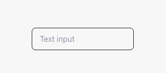

#### Input Text Active
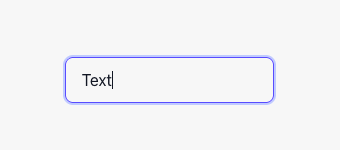

#### Input Text with Clear Button
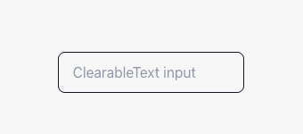

#### Input Text Clear Active
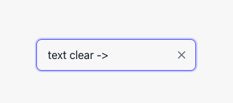

#### Input Password
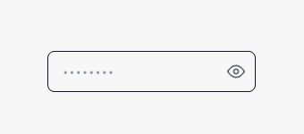

#### Input Password Active
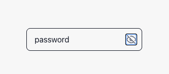

#### Input Number
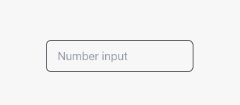

#### Input Number Active
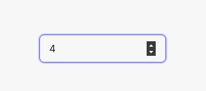

---

### 2. Toast

Notification component displayed at the bottom right with:
- Types: success, error, info, warning
- Auto-disappearance after a specified time
- Optional close button

#### Toast Success
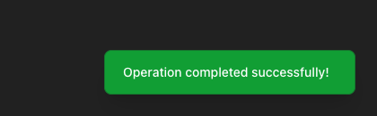

#### Toast Warning
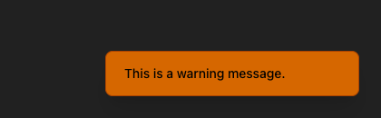

#### Toast Error
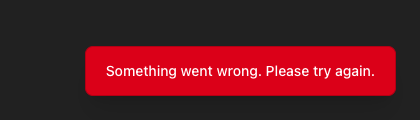

#### Toast Info with Close Button


---

### 3. Sidebar Menu

Sidebar panel that slides in from the right edge with:
- Slide animation
- Nested menu items (expandable accordion)
- Closes on background click or X button

#### Sidebar - 1 Level
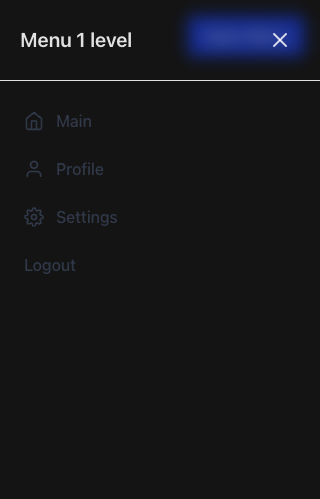

#### Sidebar - 2 Levels
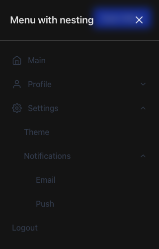

#### Sidebar - Closed
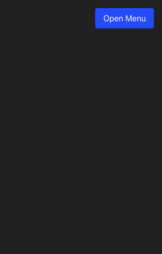

---

### UI Overview
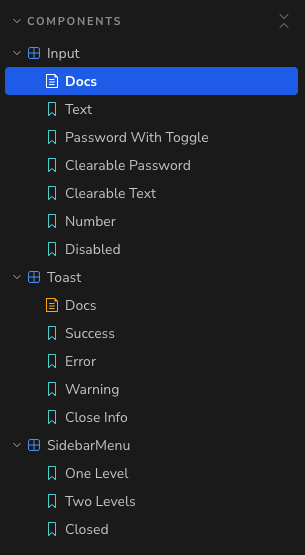


## Technology Stack

- **React 18** - UI library
- **TypeScript** - Type safety
- **Vite** - Build tool and dev server
- **Tailwind CSS** - Styling
- **Storybook** - Component documentation and testing
- **React Icons** - Icon library

